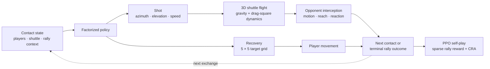

# ShuttleArena

### Interpretable Self-Play in Physics-Based Badminton

ShuttleArena is a rally-level singles badminton environment for studying how an
agent jointly learns shot selection and post-shot recovery. Players move on a
two-dimensional court while the shuttle follows a three-dimensional, high-drag
trajectory. A factorized PPO policy chooses shot azimuth, elevation, speed, and
a recovery target, making learned tactics directly inspectable.

The repository contains the simulator, factorized policy, self-play training,
frozen-checkpoint evaluation, controlled tactical probes, human-data sanity
checks, ablations, rendering, and figure-generation code used by the current
paper, **“ShuttleArena: Interpretable Self-Play in Physics-Based Badminton.”**

## How ShuttleArena works



| Component | Paper setting |
| --- | --- |
| Court and state | Singles court, 2D player positions, 3D shuttle contact and flight |
| Shuttle model | Drag-square dynamics, $k_h=0.20$, $k_v=0.16$, integration step $0.01$ s |
| Player model | Accelerated motion, speed $5.0$ m/s, acceleration $8.0$ m/s², racket reach $1.6$ m, reaction time $0.15$ s |
| Structured action | 11 azimuth × 8 elevation × 5 speed bins, followed by a 5 × 5 recovery grid |
| Policy output | 49 component logits instead of an 11,000-way monolithic action |
| Learning | PPO self-play with sparse terminal rally outcomes and eight parallel environments |
| Recovery credit | Counterfactual Recovery Advantage (CRA), coefficient $0.05$, 24 alternative recovery targets, one opponent-response sample |
| Evaluation | Frozen-checkpoint round robins, controlled probes, recovery intervention, human-data sanity check, and qualitative rollouts |

## What is included

- Physics-aware shot validation, net crossing, landing, and interception.
- Structured velocity-oriented actions with conditional feasibility handling.
- Accelerated player movement and concurrent post-shot recovery.
- PPO and factorized PPO policies with recovery-specific credit assignment.
- Checkpoint-pool self-play with recency and broader historical sampling.
- Fixed-pool win-rate matrices and Bradley–Terry/Elo-style ratings.
- Controlled shot and recovery probes that hold tactical context fixed.
- Top-view rendering, rally playback, GIF/MP4 export, and paper figures.
- A filtered ShuttleSet22 event table for the paper’s human-data sanity check.

## Quick start

```bash
git clone https://github.com/pd2714/RL_badminton.git
cd RL_badminton
python3 -m venv .venv
source .venv/bin/activate
python3 -m pip install -r requirements.txt
```

Run a heuristic rally and render its stages:

```bash
python3 scripts/demo_rally.py
```

The command writes stage images and `rally.gif` to `outputs/demo_rally/`.

Render a complete scored exhibition match:

```bash
python3 scripts/demo_match_video.py \
  --target-score 11 \
  --output-dir outputs/demo_match_video
```

This writes the stage renders, machine-readable trace, GIF, and MP4 when an MP4
writer is available.

For an interactive view of launch direction, elevation, speed, and drag:

```bash
python3 scripts/demo_trajectory_slider.py
```

## Training

Train a bootstrap PPO policy against a scripted opponent:

```bash
python3 scripts/train_ppo.py \
  --output-dir outputs/rl/bootstrap \
  --total-timesteps 200000
```

Continue from the bootstrap policy with checkpoint-pool self-play:

```bash
python3 scripts/train_selfplay.py \
  --base-checkpoint-path outputs/rl/bootstrap/best_model/best_model.zip \
  --output-dir outputs/rl/selfplay \
  --selfplay-total-timesteps 1000000 \
  --opponent-sampling-mode recency
```

Each run records its resolved arguments and artifact paths in
`selfplay_config.json`. Use `python3 scripts/train_ppo.py --help` or
`python3 scripts/train_selfplay.py --help` for the complete configuration
surface.

### Paper training schedule

The analyzed policies were trained for 6.0M self-play timesteps:

1. **0–3.0M:** a six-checkpoint, recency-biased opponent pool with a 0.05
   heuristic-opponent probability.
2. **3.0–6.0M:** a broader pool with 0.70 historical anchors sampled by linear
   recency, 0.15 recent continuation checkpoints, 0.05 newest continuation
   checkpoint, and 0.10 heuristic opponents.

Dense tactical shaping was disabled for the reported run; learning used sparse
rally outcomes. The environment is rally-level: an episode ends when the
shuttle lands, goes out, cannot be legally intercepted, or reaches the rally
length cap.

## Evaluation and paper figures

ShuttleArena evaluates both **whether** a policy improves and **how** its tactics
change. The paper does not treat one scalar metric as sufficient for a
self-play population.

| Analysis | Main entry points | Output |
| --- | --- | --- |
| Frozen-checkpoint competition | `evaluate_anchor_metrics.py`, `rate_fixed_pool_elo.py` | Pairwise win rates, matrix, Bradley–Terry/Elo ratings |
| Controlled shot behavior | `evaluate_anchor_metrics.py`, `render_controlled_contact_top3_expectation_probe_plots.py` | Conditional trajectories and action probabilities |
| Recovery behavior | `evaluate_recovery_choice_probe.py`, `plot_recovery_probability_grids.py` | Recovery distributions under fixed shot–response contexts |
| Learned-vs-centered recovery | `evaluate_recovery_ablation_fixed_pool.py`, `plot_panel_6a_ginsburg5_learned_centered_elo.py` | Fixed-pool intervention results across seeds |
| Human-data sanity check | `prepare_shuttleset22_human_events.py`, `plot_human_sanity_comparison.py` | Rally length, recovery depth, and landing comparisons |
| Qualitative rollouts | `export_checkpoint_matchup_videos.py`, `create_static_rally_exhibition.py` | Match traces, videos, and static rally panels |

For example, evaluate saved anchors against a frozen rating pool:

```bash
python3 scripts/evaluate_anchor_metrics.py outputs/rl/selfplay \
  --rating-pool-dir outputs/rl/selfplay/rating_pool \
  --episodes 200
```

The `scripts/make_*.py` and `scripts/plot_*.py` programs contain the final panel
assembly used by the paper. Cluster specifications for the multi-seed training
and evaluation runs are under `cluster/`.

## Repository map

```text
badminton1d/    environment, dynamics, policies, self-play, evaluation, rendering
scripts/        demos, training, probes, evaluations, and figure generation
tests/          physics, movement, action, RL, evaluation, and media tests
cluster/        reproducible multi-seed batch specifications
data/human/     filtered ShuttleSet22 events and provenance manifest
lookup_tables/  precomputed tactical action tables
tools/          rollout rendering utilities
```

## Tests

```bash
python3 -m pytest -q
```

The suite covers trajectory physics, legal actions, interception feasibility,
accelerated movement, recovery, rally transitions, PPO/self-play protocols,
ratings, rendering, playback, and video export.

## Reproducibility notes

- Random seeds are explicit in training and evaluation CLIs.
- Training runs write resolved configuration JSON alongside checkpoints.
- Fixed-pool evaluations record candidate/opponent identities and per-cell
  rally counts.
- Paper evaluations use frozen checkpoints; Bradley–Terry/Elo ratings are
  retrospective summaries, not training rewards.
- Generated runs and checkpoints live under `outputs/` and are excluded from
  version control because of their size.

## Acknowledgment

The human-data sanity check uses the ShuttleSet22 badminton dataset. ShuttleArena
is a physics-based self-play testbed and is not presented as a calibrated model
of professional human play.
